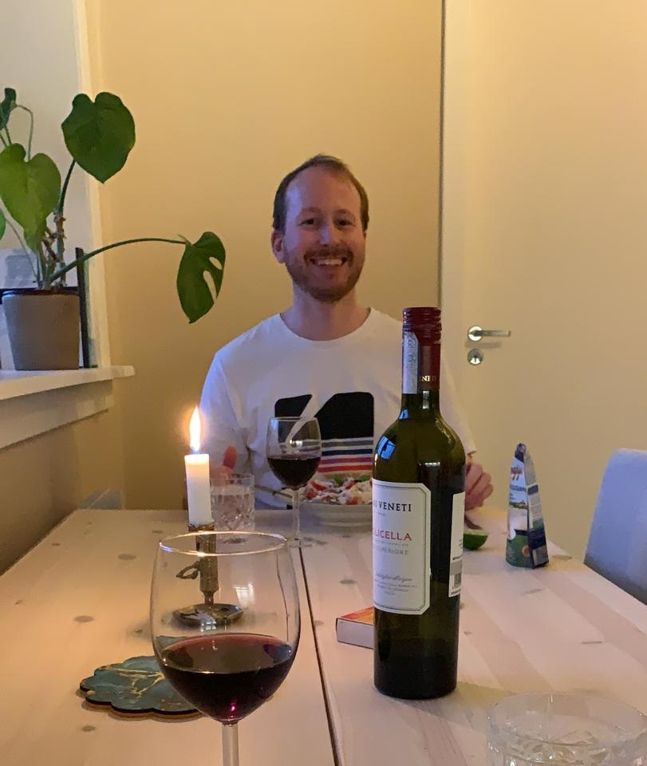



# Jon Arthur Marrable
___

### Sites
- [Instagram](https://www.instagram.com/arthur_barthur/)
- [Twitter](https://twitter.com/realDIGGART)
- [itch.io](https://diggart.itch.io/)
- [Youtube](https://www.youtube.com/channel/UCHO-FkOEDPD8G4JRSV_oEqQ)
- [GitHub](https://github.com/ArthurBarthur)

___

### Contact
- marrable@gmail.com
- [This page](https://arthurbarthur.github.io/)

___

### Most recent publication
- CDM :: Create Digital Music And Motion :: https://cdm.link/2021/03/watch-unreal-engine-make-low-latency-visualizations-thanks-to-arthur-barthur/

___

# Some things I do:

### Technical implementation (interactive media)
- Procedural generation (music, VFX, systems)
- Spatial music
- Synthesis/DSP
- Physical audio propagation
- AR/VR/MR/xR/etc
- interactive 3d everything

___

### Dev-Ops
- Large-scale infrastructure monitoring
- Configuration Management
- Global operations
- Project coordination/ownership
- Distributed systems
- LAN/WAN network design & optimization
- Web back-end (hosting, DNS, https/certs/encryption, registrar functions, load-balancing, netsec, ++++++)
- Virtualization
- AD, windows environments, etc
- Source control
- Trend analysis
- Automation (deep-layered SLA reports, anyone?)
- Cloud computing
- Disaster-recovery

___

# Contact

marrable@gmail.com
