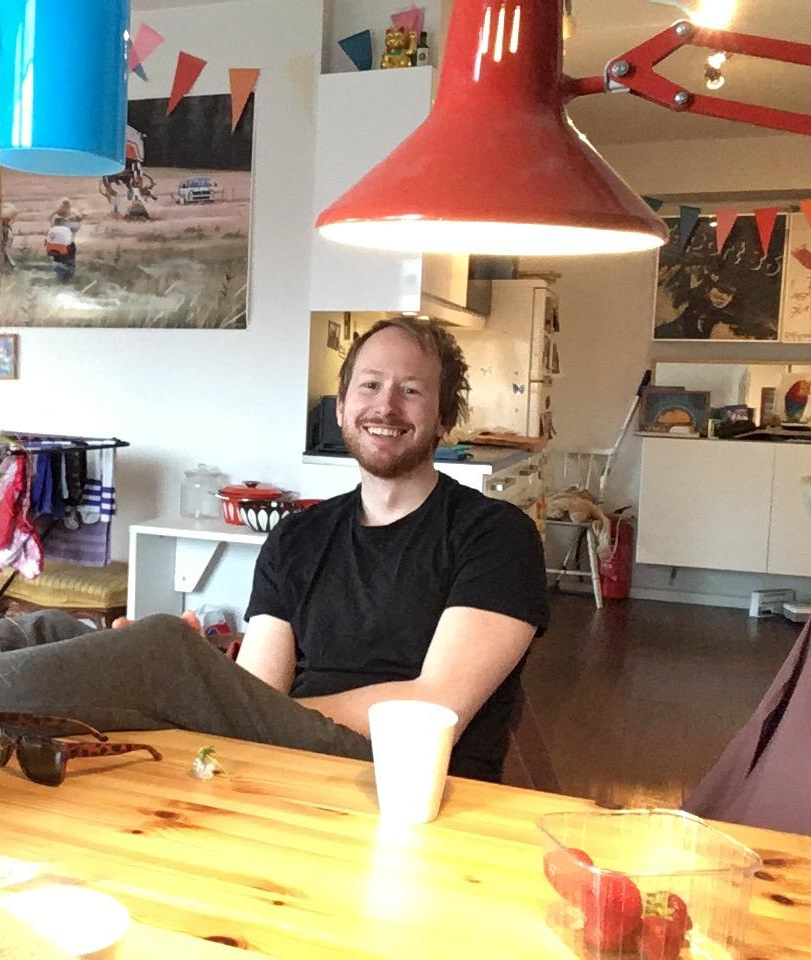

<span style="display:block">



# Jon Arthur Marrable
___
### Sites
- [GitHub](https://github.com/ArthurBarthur)
- [itch.io](https://diggart.itch.io/)
- [Youtube](https://www.youtube.com/channel/UCHO-FkOEDPD8G4JRSV_oEqQ)
- [Twitter](https://twitter.com/realDIGGART)
___
### Contact
- marrable@gmail.com
- [This page](https://arthurbarthur.github.io/)
___

# Some things I do:

### Technical implementation (interactive media)
- Procedural generation (music, VFX, systems)
- Spatial music
- Synthesis/DSP
- Physical audio propagation
- AR/VR/MR/xR/etc
- interactive 3d everything

Reel:


___
### Dev-Ops
- Large-scale infrastructure monitoring
- Configuration Management
- Global operations
- Project coordination/ownership
- Distributed systems
- LAN/WAN network design & optimization
- Web back-end (hosting, DNS, https/certs/encryption, registrar functions, load-balancing, netsec, ++++++)
- Virtualization
- AD, windows environments, etc
- Source control
- Trend analysis
- Automation (deep-layered SLA reports, anyone?)
- Cloud computing
- Disaster-recovery
___
# Samples of real-time interactive experiments:

Description | Video Links
------------ | -------------
Arthur's Audio Blueprints | [Youtube](https://www.youtube.com/playlist?list=PL_qZCECKvpx2kmmdfVcW6k6I72B30zN2N)
SpringKeys Virtual Instrument | [Youtube](https://youtu.be/y4WkcFE-mi8)
Future train-ride meditation | [Youtube](https://youtu.be/Ci3uHK8QHRk)
Desktop 3d synthesizer with infinite random presets | [Youtube](https://youtu.be/0lCJlrf3Bj8)
Acoustic Spa Experience | [Youtube](https://youtu.be/Sf01NNtXoS8)
Physical environment audio propagation demo | [Youtube](https://youtu.be/dqOSnjrB9xI)
Music Visualizer "Candy" | [Youtube](https://youtu.be/5Hb8X3R4TWY)
Music Visualizer "Rocket" | [Youtube](https://youtu.be/m6ZYMHoDMBQ)
Soft-Loop exploring | [Youtube](https://youtu.be/Xr4OubfF4RE)
Rube Goldberg-esque interactive melody machine | [Youtube](https://youtu.be/Ha2dC7se8yA)
Synthwave synthesizer car | [Youtube](https://youtu.be/sgXgEhou9Kg)
VR music composer sandbox | [Youtube](https://youtu.be/lIurIrjB7CQ)
Conway's Game Of Life as a musical 3d printer | [Youtube](https://youtu.be/S72HPXI7Xjo)
AR interactive music player | [Youtube](https://youtu.be/_nf9XGepmZI)
Behind the scenes, interactive VR piano | [Youtube](https://youtu.be/aumCMQFEFoQ)
Granular synthesis based simulation of hinge friction | [Youtube](https://youtu.be/zm4DmIe8pVE)
UE4 DAW-expander Alpha | [Youtube](https://youtu.be/tdfm-SxgSA8)

___
# Code Example:

Wave oscillators are the base noise-generators in a synthesizer. Below is a C# snippet where I generate different wavetypes inside Unitys audio-thread, writing directly to the audiobuffer:
```cs
    //AUDIOTHREAD
    void OnAudioFilterRead(float[] data, int channels)
    {
       //find audio tick delta inside audio thread
        currentDSPtime = AudioSettings.dspTime;
        deltaDSPtime = currentDSPtime - lastDSPtime;
        lastDSPtime = currentDSPtime;
        // update increment in case frequency has changed
        increment = actualFrequency * 2.0 * System.Math.PI / sampling_frequency;
        //triangle helper
        double trianglehelp = actualFrequency * 2.0 / sampling_frequency;
            for (var i = 0; i < data.Length; i = i + channels)
            {
                phase = phase + increment;
            //select wave type
            switch (_wavetypeenmumfromchord)
                {
                    case ChordSpawner.WaveTypesSelector.Sine:
                    //generate sine wave
                    data[i] = (float)(System.Math.Sin(phase));
                    break;
                    case ChordSpawner.WaveTypesSelector.Triangle:
                    //generate triangle wave
                    double div = i * trianglehelp;
                        data[i] = (float)(((((int)div) % 2 == 0) ? -finalOscGain : finalOscGain) * (1.0 - 2.0 * (div - (int)div)));
                    break;
                    case ChordSpawner.WaveTypesSelector.Square:
                    //generate square wave
                    data[i] = Mathf.Sign(Mathf.Sin((float)phase * 2f * Mathf.PI));
                    break;
                    case ChordSpawner.WaveTypesSelector.Noise:
                    //generate noise wave
                    data[i] = offset - 1.0f + (float)randomNumber.NextDouble() * 2.0f;
                    break;
                }
                //make sure channel-summing doesn't blow stuff up
                if (channels == 2) data[i + 1] = data[i];
                //reset out-of-bounds wave-phase
                if (phase > 2 * System.Math.PI) phase = 0;
            }
        //handle async frequency changes
        frequency = Mathf.MoveTowards(frequency, newFrequency, ((frequency + newFrequency) * (1 / noteLerpSpeedInSec)) * (float)deltaDSPtime);
        actualFrequency = frequency;
    }
```
### [Listen to the code in action](https://youtu.be/FpyzM4JxsrE)

### or

### [browse the rest of the code](https://github.com/ArthurBarthur/SubtractiveSynthUnityCsharp)

___
# Contact

marrable@gmail.com

</span>
